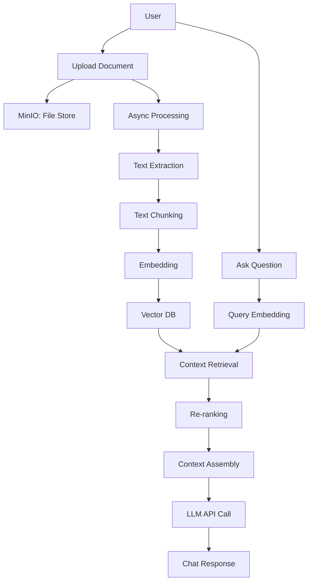

# 📘 DocuChat-RAG: Secure Retrieval-Based Chat Interface

---

## 📑 Table of Contents

1. [Introduction](#introduction)
2. [Project Overview](#project-overview)
3. [Architecture & Flow Diagram](#architecture--flow-diagram)
4. [Features](#features)
5. [Tech Stack](#tech-stack)
6. [Project Structure](#project-structure)
7. [Setup & Installation](#setup--installation)
8. [Configuration Guide](#configuration-guide)
9. [Phase-Wise Roadmap](#phase-wise-roadmap)
10. [Development Workflow](#development-workflow)
11. [Troubleshooting](#troubleshooting)
12. [License](#license)
13. [Acknowledgments](#acknowledgments)

---

## 📖 Introduction

**DocuChat-RAG** is an intelligent, secure, and modular Q&A system powered by Retrieval-Augmented Generation (RAG). It enables organizations to build chatbots that can ingest custom documents and provide accurate, reference-backed answers using LLMs.

The system is designed with a focus on:
- Security (Local + API-based LLM options)
- Performance (Vector DBs, async chunking, incremental updates)
- Customizability (Pluggable pipelines, model & database options)

---

## 🌟 Project Overview

DocuChat-RAG enables document upload, chunking, vectorization, and querying via a chat interface. It supports async document ingestion, embedding, and real-time chat response using multiple LLMs (OpenAI, DeepSeek, Ollama).

Use Cases:
- Internal knowledge base search
- Policy document chatbots
- Privacy-first document QA tools

---

## 🧠 Architecture & Flow Diagram

The system is composed of modular services:

- **Frontend (Next.js)** for UI
- **Backend (FastAPI)** for APIs
- **Document Pipeline** for ingestion & embedding
- **Vector DBs (ChromaDB / Qdrant)** for retrieval
- **LLMs** for answer generation
- **MinIO** for document storage

### 🔄 Flow Diagram



---

## ✨ Features

- 📄 **Multi-format Document Upload** (PDF, DOCX, TXT, MD)
- ⚙️ **Asynchronous Chunking & Vectorization**
- 🧠 **Context-aware Chat with LLMs**
- 📌 **Source Citation in Responses**
- 🧩 **Modular Architecture with Swappable Backends (LLM/DB)**
- 🛡 **Supports both Local and Cloud Models (OpenAI, Ollama)**
- 🔐 **API-based Access with JWT & OAuth2 Auth**
- 🧵 **Streaming Chat UI**
- 📊 **Admin Dashboard for Job Tracking, Logs, API Management**

---

## 🧰 Tech Stack

### 🔧 Backend
- **FastAPI** – REST API layer
- **LangChain** – RAG logic wrapper
- **ChromaDB / Qdrant** – Vector search engine
- **MinIO** – Distributed object store
- **MySQL** – Metadata storage
- **Python 3.9+**

### 💻 Frontend
- **Next.js 14 (React)** – UI framework
- **Tailwind CSS** – Styling
- **Shadcn/UI** – Component Library
- **TypeScript** – Safety & structure
- **Vercel AI SDK** – Streaming LLM integration

---

## 📁 Project Structure

```bash
rag-web-ui/
├── backend/
│   ├── api/               # FastAPI routes
│   ├── core/              # Config & settings
│   ├── jobs/              # Async processing
│   ├── services/          # Embedding, LLM, RAG
│   └── database/          # ORM models & DB connectors
├── frontend/
│   └── (Next.js app)
├── docker-compose.yml     # Multi-container deployment
├── .env.example           # Sample config
└── docs/
    └── images/            # UI & diagrams
```

---

## 🛠️ Setup & Installation

### 🧾 Prerequisites
- Docker & Docker Compose v2+
- Node.js 18+
- Python 3.9+
- 8GB+ RAM recommended

### 🚀 Getting Started
```bash
git clone https://github.com/rag-web-ui/rag-web-ui.git
cd rag-web-ui
cp .env.example .env
docker compose up -d --build
```

### 🌐 Access
- UI: http://127.0.0.1.nip.io
- API Docs: http://127.0.0.1.nip.io/redoc
- MinIO: http://127.0.0.1.nip.io:9001

---

## ⚙️ Configuration Guide

### Core
| Parameter                   | Description                | Required |
|----------------------------|----------------------------|----------|
| MYSQL_SERVER               | MySQL Server Address       | ✅       |
| MYSQL_USER                 | MySQL Username             | ✅       |
| MYSQL_PASSWORD             | MySQL Password             | ✅       |
| MYSQL_DATABASE             | MySQL DB Name              | ✅       |
| SECRET_KEY                 | JWT Secret                 | ✅       |
| ACCESS_TOKEN_EXPIRE_MINUTES | Token expiry (min)       | ✅       |

### LLM Setup
| Parameter        | Example              | Description         |
|------------------|----------------------|---------------------|
| CHAT_PROVIDER     | openai / ollama      | LLM Provider        |
| OPENAI_API_KEY    | sk-abc               | Key for OpenAI      |
| OLLAMA_MODEL      | llama2               | Local model name    |

### Embeddings
| Parameter                   | Example           | Description               |
|----------------------------|-------------------|---------------------------|
| EMBEDDINGS_PROVIDER        | openai            | Provider                  |
| OPENAI_EMBEDDINGS_MODEL    | text-embedding-ada-002 | OpenAI Embedding      |

---

## 🚧 Phase-Wise Roadmap

### ✅ Phase 1: MVP
- Document Upload + Chunking
- Basic Vector Search (Chroma)
- Chat UI + LLM Answering (OpenAI)

### 🚀 Phase 2: Enhancements
- Add Ollama + DeepSeek local model support
- Add Qdrant DB support
- Admin Dashboards & API key management

### 🔜 Phase 3: AI Assistants
- Workflow Automation via NL Commands
- Multi-modal support (images)
- Fine-tuning via feedback loop

---

## 🧪 Development Workflow

```bash
docker compose -f docker-compose.dev.yml up -d --build
```

1. Make changes in a feature branch
2. Run tests locally or via GitHub Actions
3. Push & Create Pull Request

### Guidelines
- Follow PEP8 for Python
- Follow Conventional Commits

---

## 🧩 Troubleshooting

Refer to the [Troubleshooting Guide](docs/troubleshooting.md) for help with:
- Docker build failures
- API issues
- Document parsing problems
- LLM API errors

---

## 📄 License

Licensed under [Apache 2.0](LICENSE)

---

## 🙏 Acknowledgments

Thanks to these open-source foundations:
- [FastAPI](https://fastapi.tiangolo.com/)
- [Langchain](https://python.langchain.com/)
- [ChromaDB](https://www.trychroma.com/)
- [Next.js](https://nextjs.org/)

---

<div align="center">
If this project helps you, please consider giving it a ⭐️
</div>

